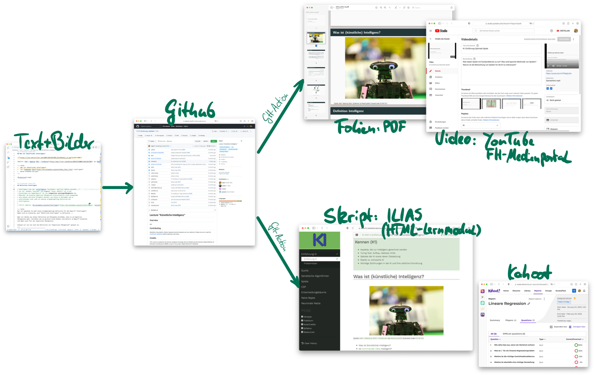

::: notes
## Persönlicher Hintergrund

-   Erfahrungen mit Open Source Software
-   Mitglied in AG OER
-   Enger Kontakt zu unseren ORCA's: Linda und Alexander
:::

## OER-Projekte in 2021

### Künstliche Intelligenz

-   Wahlpflicht Bachelor Informatik
-   Kooperation mit TDU
-   Förderung durch Digital Mobil: 5h SHK, 2x 4h Lehrersatz

\bigskip

### Compilerbau

-   Wahlpflicht Master Informatik
-   Kooperation mit University of Alberta (Canada) und Kollegin BC George
-   Förderung durch COIL/We CAN virtuOWL: 10h WHK

\bigskip

### Programmiermethoden

-   Pflicht Bachelor Informatik
-   Förderung durch DH.NRW ("digiFellow"): 50% WiMi, 10h SHK, 2x 6h Lehrersatz

## Vorgehen

::: notes
-   Sichtung des vorhandenen Materials
-   Neustrukturierung und inhaltliche Überarbeitung
-   Veröffentlichung auf Github und YouTube plus FH-Medienportal
-   Lehrunterlagen als HTML-Lernmodul im ILIAS
:::

{width="92%"}

## Lessons Learned

\bigskip

### Fast alles nochmal neu zeichnen oder erstellen

::: notes
(fühlt sich falsch an, keine wissenschaftliche Arbeitsweise) -- man bewegt sich
nicht mehr im geschlossenen Klassenraum, wo gewisse Erleichterungen gelten
:::

-   Suche nach geeigneten Bildern oft erfolglos
    ([search.creativecommons.org](https://search.creativecommons.org/),
    [unsplash.com](https://unsplash.com/), ...)
-   Fremdes Material im Produkt (Folien, Video, Skript): Lizenz vs. Zitat (Folien?!)
    vs. öff. Vorführung
-   Fremdes Material im Repo einbinden deutlich schwieriger

\bigskip

### Lizenzen und Quellen

-   Deutliche Quellenhinweise: "Autor, Titel, Lizenz" (mit Verlinkung)
-   [lizenzhinweisgenerator.de](https://lizenzhinweisgenerator.de/)  für Wikipedia-Bilder
-   Ggf. Linksammlung am Ende (Foliensatz, Video, Webseite, Repo?)
-   Hinweis auf eigene CC-Lizenz (Folie, Footer, Lizenz-Datei)

\bigskip

### Veröffentlichung

-   Github ermöglicht Zugriff und Kollaboration
-   Webseite ist ein Thema für sich (FH/Regelungen, DSGVO/Datenschutzerklärung,
    Impressum)
-   ORCA (Stand November 2021): Upload von Materialien OK, Zugriff? Suche?
    Kollaboration???, Aktualisierung/Versionierung/Releases???

## Persönliches Fazit

-   Extrem anstrengender und zeitaufwändiger Prozess
-   Große Unsicherheiten bzgl. rechtlicher Aspekte
-   Wie erleichtere ich die Nachnutzung

\bigskip

-   Kooperation mit anderen Lehrenden
-   Interaktion mit Studierenden (!), positives Feedback

\bigskip
\bigskip

> "Wir werden mit öffentlichem Geld bezahlt, also sollten unsere Arbeitsergebnisse auch öffentlich verfügbar sein."
>
> \hfill\ -- Motto von Nelson Amaral

<!-- DO NOT REMOVE - THIS IS A LAST SLIDE TO INDICATE THE LICENSE AND POSSIBLE EXCEPTIONS (IMAGES, ...). -->
::: slides
## LICENSE

Unless otherwise noted, this work is licensed under CC BY-SA 4.0.
:::
